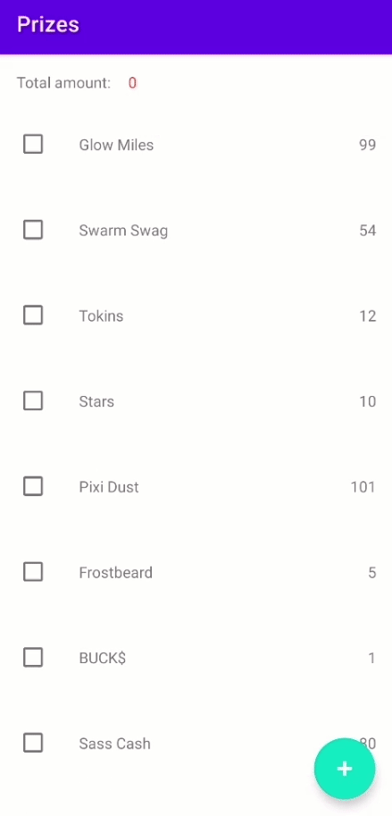

# Prizes 

### Description

There is a list of "prizes" with a "price" for each. It looks like a regular table with cells with text and price. It is possible to select prizes (mark cells with checkmarks) for the total price of 100. Somewhere in the UI, the user sees the total amount for which the prizes have been selected. Each subsequent selection over the limit must deselect the required amount from the first selected prizes. At the same time, it is possible to add new prizes (the “+” button on the right in the navigation bar with a transition to the screen from adding a new prize) and delete prizes from the list (native swipe to the left with the Delete button).
The list of prizes with prices must be stored in the database.

### Components used
* MVVM
* Room
* Architecture Components (LiveData and ViewModel)

### Screenshots

  

